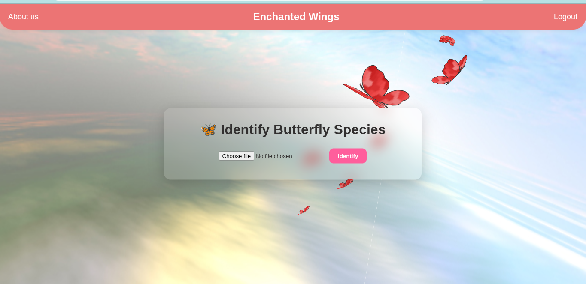
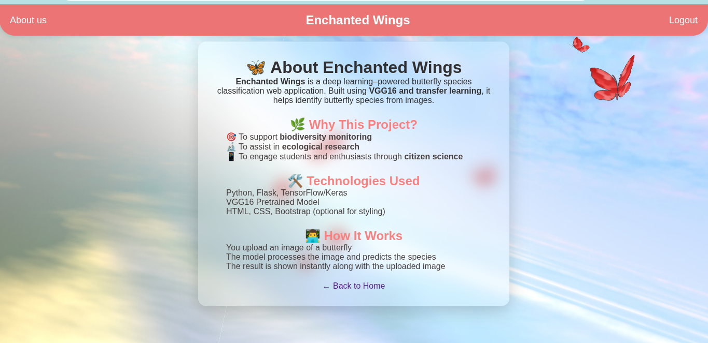
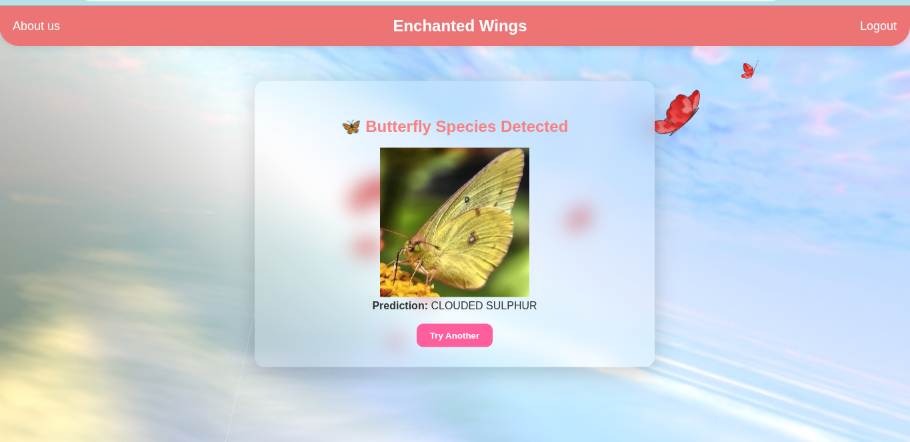
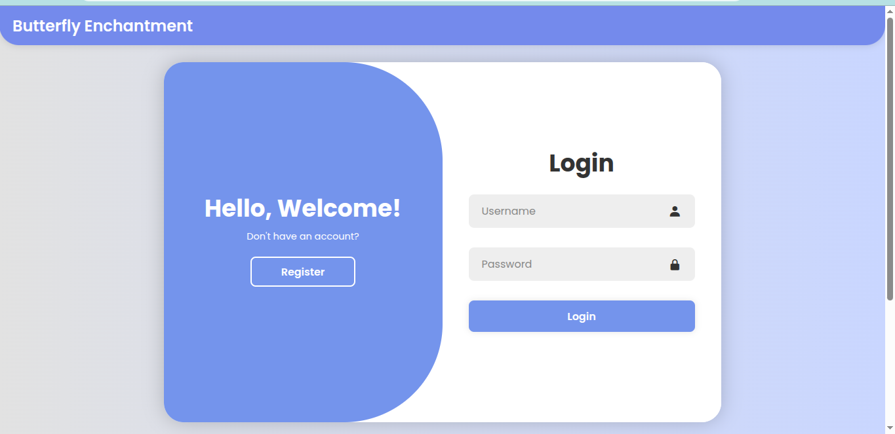

# 🦋 Enchanted Wings: Butterfly Species Classifier

**Enchanted Wings** is a deep learning–based web application that identifies butterfly species from uploaded images using a fine-tuned VGG16 model. The application supports biodiversity monitoring, ecological research, and educational engagement through an intuitive, visually appealing interface.

---

## 🚀 Features

- 🧠 Transfer learning with VGG16 for high accuracy
- 🖼️ Image upload and real-time butterfly species prediction
- 🌐 Flask-based web interface
- 🎨 Glassmorphic UI with animated butterfly background
- 🔒 Optional user authentication
- 📄 Detailed About Page

---

## 📸 Demo

Try it locally by uploading a butterfly image and getting the species name instantly.

---

## 📁 Project Structure

EnchantedWings/ 
├── app.py # Main Flask backend 
├── vgg16_model.h5 # Trained model 
│ 
├── static/ 
│ 
├── templates/ 
│ ├── home.html # Upload and prediction UI 
│ ├── output.html # Result display page 
│ ├── about.html # Info page 
| └── SignUp_Login.html 
│ 
├── database/users.db # SQLite DB for user login (optional) 
├── requirements.txt # Dependencies 
└── README.md # You're here! 

## ⚙️ Installation

### 🔹 Step 1: Clone the Repository

git clone https://github.com/phani-kumar-sajja/Enchanted-Wings.git
cd enchanted-wings
### 🔹 Step 2: Create a Virtual Environment

python -m venv venv
source venv/bin/activate  # On Windows: venv\\Scripts\\activate
### 🔹 Step 3: Install Dependencies

pip install -r requirements.txt
### 🔹 Step 4: Run the App

python app.py
Open your browser at http://127.0.0.1:5000

🧠 Model
Architecture: VGG16

Framework: Keras + TensorFlow

Dataset: ~6,500 butterfly images across 75 species

Training: Conducted using transfer learning with frozen base layers and a custom classifier head

🌟 Screenshots 
Home Page  
About Page  
Result Page  
Login Page  

✨ Future Improvements
Add multilingual species descriptions

Enable mobile camera integration

Improve model with more data and augmentation

Deploy on platforms like Render, Vercel, or AWS

🛡️ License
MIT License © 2025 [Techie Bugs]

🤝 Acknowledgments 
<a href="https://www.kaggle.com/">Kaggle Butterfly Dataset</a> 

<a href="https://www.tensorflow.org/">TensorFlow</a> 

<a href="https://flask.palletsprojects.com/">Flask</a> 

Inspired by the natural beauty of butterflies and the need for ecological awareness 🦋
